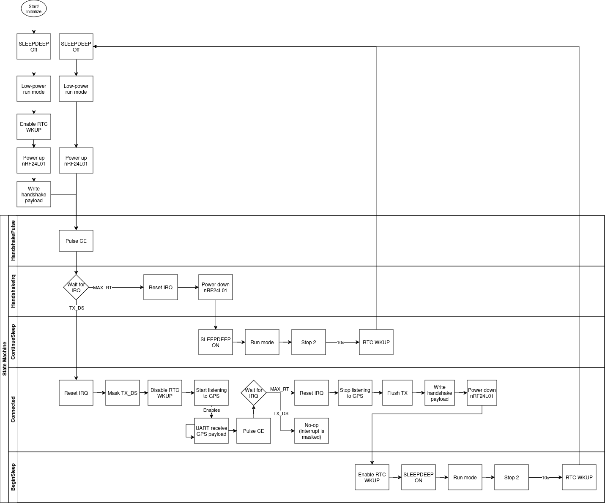

# GPS Relay
This is a device that transmits GPS data to a receiver. It is optimized for extremely low-power consumption.

## Functional Description
### Operation
The device will broadcast a _handshake_ request every 10 seconds. If a connection is established with the receiver, the device will wake up from its power-saving mode and start transmitting its GPS location. When the connection is lost, the device will enter its power-saving mode again and seek a new connection.

### GPS Protocol
The GPS data is received as NMEA sentences.

## State Diagram

## Pins

